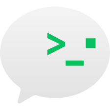
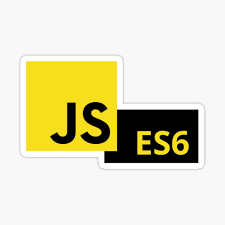
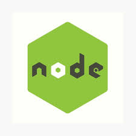

### 🌱biubiuliu

<!--
**biubiuliu/biubiuliu** is a ✨ _special_ ✨ repository because its `README.md` (this file) appears on your GitHub profile.

Here are some ideas to get you started:

- 🔭 I’m currently working on sz
- 🌱 I’m currently learning vue
- 👯 I’m looking to collaborate on ...
- 🤔 I’m looking for help with ...
- 💬 Ask me about ...
- 📫 How to reach me: ...
- 😄 Pronouns: ...
- ⚡ Fun fact: ...
- -->

#### 😄 说点什么
- 🏢 目前在深圳
- ⏰ 6点起床计划... (2022 0428)
- 💖 july is a baby name
- 🏁 未完待续...

 

 <!-- #### 👆 我会这些
 

 
 
 
 
 
 
 
 

 

 -->
